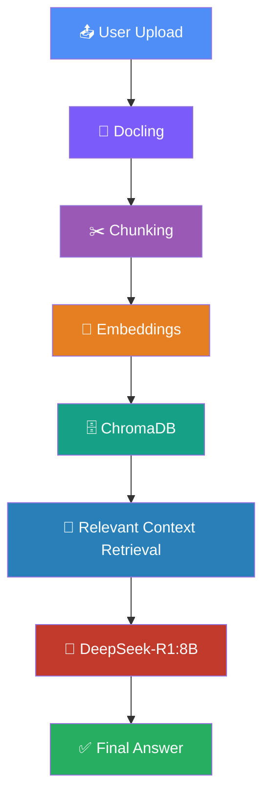
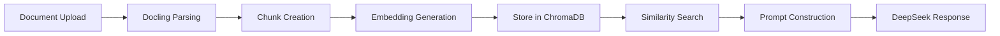

<div align="center">

# 📚 ReDocs — Legal Document Reviewing AI

### Turn dense legal paperwork into instant, cited answers.

*An AI-powered legal document assistant built on Retrieval-Augmented Generation (RAG), local LLM inference, and vector search.*

[](https://www.python.org/)
[](https://fastapi.tiangolo.com/)
[](https://react.dev/)
[](#-rag-workflow)
[](#-using-ollama)
[](#-license)

</div>

---

## 📑 Table of Contents

- [🔍 Overview](#-overview)
- [✨ Features](#-features)
- [🏗️ Architecture](#️-architecture)
- [📂 Folder Structure](#-folder-structure)
- [⚙️ Installation](#️-installation)
- [📥 Clone Repository](#-clone-repository)
- [📦 Install Dependencies](#-install-dependencies)
- [🚀 Start Application](#-start-application)
- [🔐 Configuration](#-configuration)
- [🦙 Using Ollama](#-using-ollama)
- [🖱️ Usage](#️-usage)
- [🔌 API Endpoints](#-api-endpoints)
- [🔄 RAG Workflow](#-rag-workflow)
- [🛠️ Technologies Used](#️-technologies-used)
- [🖼️ Screenshots](#️-screenshots)
- [⚡ Performance](#-performance)
- [🗺️ Future Improvements](#️-future-improvements)
- [🤝 Contributing](#-contributing)
- [📄 License](#-license)
- [👤 Author](#-author)
- [🙏 Acknowledgements](#-acknowledgements)

---

## 🔍 Overview

**ReDocs** is an AI-powered legal document reviewing application that lets you upload contracts, agreements, policies, or any legal document and ask natural-language questions about them — getting accurate, context-grounded answers in seconds.

Legal documents are long, dense, and full of jargon. Manually reviewing them for key clauses, obligations, or risks is slow and error-prone. ReDocs solves this by combining:

- **Docling** to parse documents into clean structured text, then chunk them with `HybridChunker`
- **ChromaDB** (running embedded — no separate server) with a **BAAI/bge-m3** embedding function for vector storage and similarity search
- **LangChain** (`langchain-ollama`) to orchestrate calls to **DeepSeek-R1:8B**, served locally via Ollama
- **FastAPI** as the backend serving the RAG pipeline (`main.py`), paired with a **React + Vite** chat UI (`Frontend`)

### 💡 Why ReDocs Exists

Traditional keyword search fails on legal text because meaning matters more than exact wording. ReDocs uses **Retrieval-Augmented Generation (RAG)** — retrieving the *most relevant* sections of a document before generating an answer — so responses stay accurate, traceable, and grounded in the actual document content instead of hallucinated legal advice.

### 🧑‍⚖️ Real-World Use Cases

| Use Case | Description |
|---|---|
| **Contract Review** | Quickly find clauses on termination, liability, or indemnification |
| **Due Diligence** | Ask questions across NDAs, MSAs, or compliance documents |
| **Legal Research** | Summarize lengthy agreements without reading them line-by-line |
| **Paralegal Assistance** | Speed up first-pass document triage before attorney review |
| **Policy Auditing** | Check internal policies against regulatory requirements |

### 🎯 Benefits

- ⚡ Faster document comprehension
- 🎯 Context-grounded, citation-friendly answers
- 🔒 Runs fully locally — no data leaves your machine (via Ollama)
- 🧩 Modular, extensible pipeline
- 💸 No per-token API costs — local inference

> **Note:** ReDocs is a productivity aid, not a substitute for professional legal advice.
>
> **Current scope:** the backend keeps one active document at a time — uploading a new file replaces the previous one in the vector store (the `User01` collection is dropped and recreated on every `/upload`). Multi-document sessions are listed under [Future Improvements](#️-future-improvements).

---

## ✨ Features

- 📤 **Document Upload** — Upload a legal document as a PDF
- 🔧 **Docling-Powered Conversion** — Converts raw documents into clean, structured text
- ✂️ **Automatic Chunking** — Docling's `HybridChunker` splits documents into token-aware, merged chunks
- 🧬 **Embedding Generation** — Chunks are embedded with the `BAAI/bge-m3` sentence-transformer model
- 🗄️ **ChromaDB Vector Storage** — Embedded, file-backed ChromaDB persists vectors locally (no separate DB server)
- 🔍 **RAG-Based Retrieval** — Fetches the top-3 most relevant chunks per query
- 🤖 **AI-Powered Q&A** — Answers questions using DeepSeek-R1:8B (via Ollama + LangChain)
- 🧠 **Semantic Search** — Understands meaning, not just keywords
- ⚡ **Fast Responses** — Optimized retrieval + local inference pipeline
- 🎨 **Clean, Futuristic UI** — `Frontend`, a dark-themed React + Vite interface with an icon rail, session sidebar, and animated waveform loading state
- 🧱 **Extensible Architecture** — Swap models, vector stores, or parsers easily

---

## 🏗️ Architecture

ReDocs follows a clean, linear RAG pipeline from upload to answer:



---

## 📂 Folder Structure

```
ReDocs/
│
├── Frontend/             # Frontend — React + Vite chat UI
│   ├── index.html
│   ├── package.json
│   ├── package-lock.json
│   ├── vite.config.js
│   ├── README.md
│   └── src/
│       ├── main.jsx          # React entry point
│       ├── App.jsx           # App state + backend calls (/upload, /ask)
│       ├── index.css         # Design tokens + all styling
│       └── components/
│           ├── Rail.jsx       # Leftmost icon rail
│           ├── Sidebar.jsx    # Shows uploaded document + "new session"
│           ├── Topbar.jsx     # Backend status + theme toggle
│           ├── ThreadView.jsx # Scrollable message list
│           ├── Message.jsx    # Message bubble (incl. "Thinking..." animation)
│           └── Composer.jsx   # Text input + send + file-upload button
│
├── sample data/               # Sample legal documents for testing the pipeline
├── Data/                       # Auto-created at runtime by main.py — stores the
│                               # uploaded PDF *and* the persistent ChromaDB index
├── main.py                     # FastAPI backend entry point (RAG pipeline)
└── README.md                    # You are here 📍
```

| Folder / File | Purpose |
|---|---|
| `Frontend/` | React + Vite frontend — the chat interface used to upload documents and ask questions |
| `Frontend/src/App.jsx` | Central state management and all calls to the FastAPI backend (`/upload`, `/ask`) |
| `Frontend/src/components/` | Individual UI components (sidebar, message bubbles, composer, top bar, icon rail) |
| `Frontend/src/index.css` | All design tokens, colors, fonts, and spacing (`:root` variables) |
| `sample data/` | Example legal documents to test uploads and Q&A against |
| `Data/` | Created automatically the first time you upload a document. Holds the raw uploaded PDF and the on-disk ChromaDB `PersistentClient` store. Safe to delete to reset the app's state. |
| `main.py` | FastAPI backend — handles document parsing (Docling), chunking, embedding (BAAI/bge-m3), ChromaDB storage, and DeepSeek-R1:8B inference via LangChain + Ollama |

> ⚠️ **Note:** `main.py` is currently a single-file FastAPI backend rather than split into `routes/` / `controllers/` / `services/`. If you've since modularized it, update this section to match.

---

## ⚙️ Installation

### ✅ Prerequisites

Make sure you have the following installed before proceeding:

| Requirement | Purpose | Link |
|---|---|---|
| **Python** (3.10+) | Runs the FastAPI backend and RAG pipeline | [python.org](https://www.python.org/) |
| **Node.js** (v18+) | Runs the `Frontend` (Vite) | [nodejs.org](https://nodejs.org/) |
| **npm** | Frontend package management | Comes with Node.js |
| **Ollama** | Runs DeepSeek-R1:8B locally | [ollama.com](https://ollama.com/) |
| **Git** | Version control | [git-scm.com](https://git-scm.com/) |

> 💡 **ChromaDB isn't a separate service here** — `main.py` uses `chromadb.PersistentClient`, an embedded, file-backed store written to the `Data/` folder. There's nothing to install or run beyond the `chromadb` Python package pulled in by `pip install`.

---

## 📥 Clone Repository

```bash
git clone https://github.com/arnav-terex/ReDocs.git
cd ReDocs
```

---

## 📦 Install Dependencies

ReDocs has two parts — install each separately.

**Backend (Python / FastAPI):**
```bash
pip install -r requirements.txt
```

If there's no `requirements.txt` yet, based on `main.py`'s imports you'll need at least:
```bash
pip install fastapi "uvicorn[standard]" python-multipart pydantic \
            langchain-core langchain-ollama \
            chromadb sentence-transformers \
            docling
```
> 💡 **Tip:** Run `pip freeze > requirements.txt` after installing so future installs are reproducible with one command.

**Frontend (React / Vite):**
```bash
cd Frontend
npm install
cd ..
```

> ⚠️ **Note:** `python-multipart` is required even though it isn't imported directly — FastAPI needs it under the hood to parse the `UploadFile` in `/upload`.

---

## 🚀 Start Application

Run the backend and frontend in **two separate terminals**. Make sure `ollama serve` is running in the background first (Ollama usually starts this automatically after install).

```bash
npm start
```
This single command starts Frontend and Backend both
Backend runs on `http://localhost:8000` by default (uvicorn's default port — `main.py` doesn't set one explicitly).

1. The FastAPI backend starts up (ChromaDB connects lazily — its store is created on first upload, not at startup)
2. It exposes `/upload` and `/ask` endpoints on `http://localhost:8000`
3. The Vite dev server serves the `Frontend` UI at the printed local URL (typically `http://localhost:5173`)
4. The frontend calls the backend directly — CORS is enabled in `main.py` for `http://localhost:5173` and `http://localhost:3000` only. If you serve the frontend from a different origin, add it to the `allow_origins` list in `main.py`

---

## 🔐 Configuration

`main.py` currently doesn't read a `.env` file — there are no environment variables to set. The relevant settings are hardcoded directly in the source:

| Setting | Where it lives in `main.py` | Value |
|---|---|---|
| Ollama model | `ChatOllama(model=...)` | `deepseek-r1:8b` |
| Embedding model | `SentenceTransformerEmbeddingFunction(model_name=...)` | `BAAI/bge-m3` |
| Allowed frontend origins (CORS) | `app.add_middleware(CORSMiddleware, allow_origins=[...])` | `http://localhost:5173`, `http://localhost:3000` |
| Storage location | `DB_PATH = os.path.join(BASE_DIR, "Data")` | `./Data` (relative to `main.py`) |
| Chunk size | `HybridChunker(max_tokens=...)` | `400` tokens |
| Retrieved chunks per query | `collection.query(n_results=...)` | `3` |

To change any of these, edit the values directly in `main.py` for now. If you'd like these pulled out into a `.env` file (using `python-dotenv` or `pydantic-settings`), that's a reasonable addition — see [Future Improvements](#️-future-improvements).

If the frontend's `BACKEND_URL` (top of `Frontend/src/App.jsx`) points somewhere other than `http://localhost:8000`, update it there — it's hardcoded on the frontend side too.

---

## 🦙 Using Ollama

ReDocs uses **Ollama** to run the DeepSeek-R1:8B model locally.

### 1️⃣ Install Ollama

Download and install from [ollama.com/download](https://ollama.com/download), or on macOS/Linux:

```bash
curl -fsSL https://ollama.com/install.sh | sh
```

### 2️⃣ Pull the DeepSeek Model

```bash
ollama pull deepseek-r1:8b
```

### 3️⃣ Verify Installation

```bash
ollama list
```

You should see `deepseek-r1:8b` listed among your available models.

> ⚠️ **Note:** The model requires sufficient RAM/VRAM. Check the [Ollama model page](https://ollama.com/library/deepseek-r1) for system requirements.

---

## 🧠 About ChromaDB in This Project

Unlike a typical client-server ChromaDB setup, `main.py` uses `chromadb.PersistentClient(path=DB_PATH)` — an **embedded** instance that reads and writes directly to disk. There's no `chroma run` server to start and no Docker container to manage.

- The store lives at `./Data` (created automatically on first upload)
- Each upload deletes and recreates a single collection named `User01`, so only one document's worth of chunks exists in the store at a time
- To fully reset the app's memory, just delete the `Data/` folder

> 💡 If you later move to a multi-document or multi-user setup, switching to a client-server ChromaDB deployment (`chroma run` or the Docker image) would be the natural next step — see [Future Improvements](#️-future-improvements).

---

## 🖱️ Usage

1. **Clone** the repository
2. **Install** backend dependencies (`pip install -r requirements.txt`) and frontend dependencies (`cd Frontend && npm install`)
3. **Pull** the DeepSeek model via Ollama and make sure `ollama serve` is running
4. **Run** the backend: `uvicorn main:app --reload`
5. **Run** the frontend: `cd Frontend && npm run dev`
6. **Upload** a legal document through the UI (this creates the `Data/` folder and vector store)
7. **Ask questions** about the document and get instant AI-generated answers

---

## 🔌 API Endpoints

### `POST /upload`

Uploads and processes a legal document (PDF). Expects a multipart `FormData` request with a `file` field. This **replaces** any previously uploaded document — the vector store holds one document at a time.

**Request:**
```bash
curl -X POST http://localhost:8000/upload \
  -F "file=@contract.pdf"
```

**Response:**
```json
{
  "message": "'contract.pdf' processed! 47 chunks stored."
}
```

### `POST /ask`

Asks a question against the currently stored document.

**Request:**
```bash
curl -X POST http://localhost:8000/ask \
  -H "Content-Type: application/json" \
  -d '{"question": "What is the termination clause?"}'
```

**Response:**
```json
{
  "answer": "The agreement may be terminated by either party with 30 days written notice..."
}
```

There is currently no `/health` endpoint in `main.py` — just these two routes.

---

## 🔄 RAG Workflow



1. **Document Upload** — User submits a PDF via the UI or API; it's saved into `Data/`
2. **Docling Parsing** — Converts the raw document into structured, clean text
3. **Chunk Creation** — Docling's `HybridChunker` splits text into merged, token-bounded segments (max 400 tokens, using the `all-MiniLM-L6-v2` tokenizer for length counting)
4. **Embedding Generation** — Each chunk is embedded with the `BAAI/bge-m3` sentence-transformer model
5. **Store in ChromaDB** — Embeddings and heading metadata are written to the embedded, file-backed `User01` collection (previous collection is dropped first)
6. **Similarity Search** — The user's question is embedded and matched against the top 3 most similar chunks
7. **Prompt Construction** — Retrieved chunks are joined into a context block and wrapped in a prompt via LangChain's `HumanMessage`
8. **DeepSeek Response** — `ChatOllama` sends the prompt to DeepSeek-R1:8B (temperature `0.3`) and returns the generated answer

---

## 🛠️ Technologies Used

| Technology | Role |
|---|---|
| **Python** | Backend language |
| **FastAPI** | REST API framework serving the RAG pipeline (`main.py`) |
| **React + Vite** | Frontend chat UI (`Frontend`) |
| **Docling** | Document parsing & `HybridChunker`-based chunking |
| **sentence-transformers** | Embedding model runtime (`BAAI/bge-m3`) |
| **ChromaDB** | Embedded, file-backed vector database |
| **LangChain (`langchain-ollama`)** | Orchestrates prompt construction and calls to Ollama |
| **Ollama** | Local LLM serving runtime |
| **DeepSeek-R1:8B** | Large language model for Q&A |
| **JavaScript / JSX** | Frontend programming language |
| **npm** | Frontend package management |

---

<!-- ## 🖼️ Screenshots

> 📸 *Add screenshots of your application here once available.*

<!--


-->

--- -->

## ⚡ Performance

- 🚀 **Fast retrieval** via an embedded ChromaDB store (no network hop to a separate DB server)
- 🧬 **Efficient embeddings** via the lightweight `BAAI/bge-m3` sentence-transformer model
- 🔍 **Semantic search** that understands intent, not just keywords
- 🖥️ **Local inference** — DeepSeek-R1:8B runs entirely through Ollama, with `keep_alive=0` unloading it from RAM/VRAM right after each answer

---

## 🗺️ Future Improvements

- [ ] 💬 Multi-document chat sessions (currently one document replaces the last)
- [ ] ✏️ PDF annotations
- [ ] 🔠 OCR support for scanned documents
- [ ] 🔐 Authentication & authorization
- [ ] 👤 User accounts & document history
- [ ] 📡 Streaming responses
- [ ] 📎 Inline citation support
- [ ] ⚙️ Move hardcoded settings (model names, CORS origins, storage path) into a `.env` file
- [ ] 🐳 Docker deployment

---

## 🤝 Contributing

Contributions are welcome! To contribute:

1. **Fork** the repository
2. **Create** a feature branch
   ```bash
   git checkout -b feature/your-feature-name
   ```
3. **Commit** your changes
   ```bash
   git commit -m "Add: your feature description"
   ```
4. **Push** to your branch
   ```bash
   git push origin feature/your-feature-name
   ```
5. **Open** a Pull Request

> 💡 **Tip:** Please open an issue first for major changes to discuss what you'd like to modify.

---

<!-- ## 📄 License

This project is licensed under the **MIT License** — see the [LICENSE](./LICENSE) file for details.

---

## 👤 Author

**Your Name Here**

- GitHub: [@arnav-terex](https://github.com/arnav-terex)
- Email: your-email@example.com
- LinkedIn: [your-linkedin](https://linkedin.com)

--- -->

## 🙏 Acknowledgements

- [Docling](https://github.com/DS4SD/docling) — Document conversion & chunking
- [ChromaDB](https://www.trychroma.com/) — Embedded vector database
- [LangChain](https://www.langchain.com/) — LLM orchestration (`langchain-ollama`)
- [sentence-transformers](https://www.sbert.net/) — Embedding model runtime
- [Ollama](https://ollama.com/) — Local LLM serving
- [DeepSeek](https://www.deepseek.com/) — DeepSeek-R1 model
- [FastAPI](https://fastapi.tiangolo.com/) — Backend framework
- [React](https://react.dev/) + [Vite](https://vitejs.dev/) — Frontend

---

<div align="center">

**⭐ If you find ReDocs useful, consider giving it a star on GitHub! ⭐**

</div>
